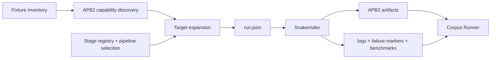

# Architecture

APB Studio discovers ProteoBench fixtures, asks APB2 which quantification levels each fixture can produce, freezes concrete commands into a run snapshot, and lets Snakemake execute them. Studio does not implement vendor parsing, FASTA matching, level aggregation, or ProteoBench scoring.

Two parts share one settings file:

- **Fixture store**: `apb-studio-fixtures` downloads every ProteoBench submission, both FASTAs and
  all module TOMLs into `test_data_root`, summarises them, and serves a plain-JavaScript viewer
  over the resulting CSVs and JSON. Layout: `catalog.csv`, `metadata/`, `submissions/`,
  `downloads.csv`, `fasta/`, `modules/`, `summaries.csv`, `resources.csv`, `index.json`.
- **Corpus Runner** resolves APB2 branches, launches whole-corpus run or clean operations, and
  reports artifacts, timings, and exact failures. Its Dash application was removed on
  2026-09-04; the headless scripts remain and a static viewer replaces the app.

## Workflow shapes

The stage catalogue in `config/registry.yaml` defines two paths.

```text
staged:
  apb2 convert
      -> apb-fasta verify-peptides
      -> apb-aggregate ion protein sum       [when ion exists]
      -> apb-aggregate fragment protein sum  [when fragment exists]
      -> apb-proteobench benchmark

direct:
  apb-proteobench run
```

The staged path persists every applicable boundary. Aggregation is MuData-only because upward aggregation retains both source and target levels. If just one of ion or fragment exists, ProteoBench reconnects to that result; if neither aggregation stage applies on a standalone branch, it reconnects to the FASTA-checked result. The direct path runs all work in memory and persists one final `mudata.raw-proteobench.h5mu` per fixture.

The legacy `apb` library is gone from Studio: nothing imports it, and the fixture store needs
only the standard library, pandas, pyarrow, requests and beautifulsoup4.

## Four boundaries

| Boundary | Owner | Files |
| --- | --- | --- |
| Stage definition | commands, dependencies, required resources | `config/registry.yaml` |
| Pipeline selection | staged, direct, or conversion-only target set | `config/pipelines/*.yaml`, `registry.py` |
| Resolution | fixtures + APB2 capabilities → concrete targets | `capabilities.py`, `pipeline.py`, `execution.py` |
| Execution and observation | scheduling, logs, markers, timing, UI | `workflow/Snakefile`, `provenance.py`, `dashboard.py` |

Resolution ends by writing one immutable `run.json`; execution begins by reading it.



## Capability discovery

Supported levels are APB2's answer. `capabilities.discover_capabilities()` parses the vendor
parameter file, detects the packaged rule document from parameter evidence and source columns, and
compiles each compatible parser without loading the quantitative dataset. A supported fixture
produces `mudata` followed by APB2's compatible standalone levels. Studio maintains no vendor or
level map.

The discovery cache key includes input and parameter mtimes plus a fingerprint of APB2's packaged
rule documents, so changing either data or rules invalidates the answer.

## `run.json` is the execution interface

Each operation writes:

```text
<output_root>/.apb_studio/runs/<run-id>/run.json
```

The versioned snapshot contains resolved fixture identities, source paths, resources, branches,
the selected pipeline, exact argv, input edges, outputs, registry digest, and APB2 version. It is
internal execution state, not user configuration, and is immutable after creation. Snakemake never
rediscovers fixtures or rerenders commands.

The Snakefile resolves the four tool names against its own Python environment:

- `apb2`
- `apb-fasta`
- `apb-aggregate`
- `apb-proteobench`

No legacy `apb` executable fallback exists.

## Filesystem state

The output tree is the status database:

```text
<output_root>/<module>/<dataset>/mudata.h5mu
<output_root>/<module>/<dataset>/mudata.fasta.h5mu
<output_root>/<module>/<dataset>/mudata.aggregate-ion.h5mu
<output_root>/<module>/<dataset>/mudata.aggregate-fragment.h5mu
<output_root>/<module>/<dataset>/mudata.proteobench.h5mu
<output_root>/<module>/<dataset>/ion.h5ad
<output_root>/<module>/<dataset>/ion.fasta.h5ad
<output_root>/<module>/<dataset>/ion.proteobench.h5ad
<output_root>/<module>/<dataset>/mudata.raw-proteobench.h5mu
```

Each artifact may also have `.log`, `.failed`, `.benchmark.tsv`, and `.provenance.json` sidecars.
An artifact means `DONE`; a non-zero rule writes the authoritative `.failed` marker; a live log
without that marker remains pending. Benchmark TSVs are the only source of recorded runtime.

## Invariants

- Pipeline documents select catalogue stages; they never restate commands.
- A staged pipeline is closed under `depends_on`: convert → FASTA → ion aggregation → fragment aggregation → ProteoBench.
- Direct execution is restricted to the MuData branch because it converts all compatible levels.
- Missing resources block only targets that require them; independent conversion remains runnable.
- The grid is an observer, not a row- or stage-scoped executor.
- Clean removes managed artifacts and sidecars but never fixture inputs or persisted run history.
- `run.json` paths are absolute, and outputs must remain under the frozen output root.
